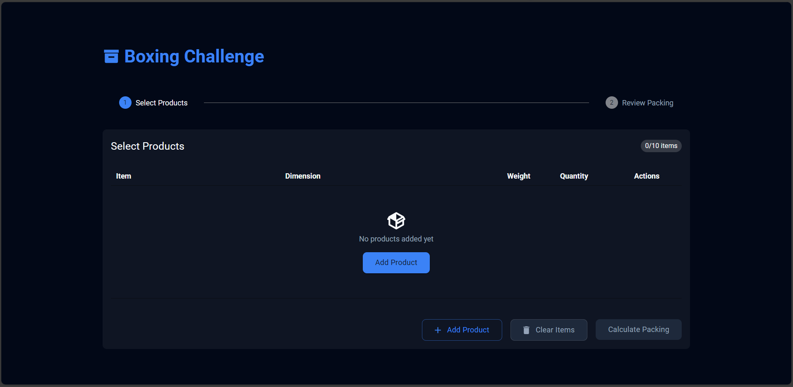

# Packing Algorithm React Application

## Overview



This React application determines the smallest box or combination of boxes required to fit a set of products, adhering to predefined constraints. The project demonstrates your ability to solve algorithmic problems, write clean and reusable code, and implement a functional UI.

## Features

1. **Advanced Packing Algorithm**: Efficiently determines the optimal box configuration, prioritizing minimal space usage and strict adherence to weight limits for a seamless packing solution.
2. **User-Friendly Interface**: A streamlined and intuitive UI allows users to easily input product details and instantly visualize the packing results.
3. **Robust Error Handling**: Provides clear and actionable error messages for products that exceed the size or weight constraints of available boxes.
4. **Modular Reusable Components**: Built with well-structured, reusable React components for scalability and maintainability.
5. **TypeScript for Reliability**: Ensures robust and error-free development with strongly typed props, state, and functions, enhancing code clarity and maintainability.
6. **Comprehensive Testing Suite**: Includes extensive unit tests for the packing algorithm and key React components, ensuring accuracy and reliability under various scenarios.
7. **Integration of External Libraries**: Leverages powerful libraries such as Material-UI for professional-grade UI components and Lodash for efficient utility functions, enriching the development experience.

---

## Installation and Setup

### Prerequisites

- Node.js (v22)
- npm (Comes with Node.js)

### Steps

1. Clone the repository:

   ```bash
   git clone https://github.com/CodeEx24/product-box-test.git
   cd product-box-test
   ```

2. Install dependencies:
   ```bash
   npm install
   ```
3. Start the development server:
   ```bash
   npm run dev
   ```
4. Open the application in your browser:
   ```
   http://localhost:3000
   ```

### Build for Production

1. Build the app:
   ```bash
   npm run build
   ```
2. Start the preview server:
   ```bash
   npm run preview
   ```
3. Open the application in your browser:
   ```
   http://localhost:3001
   ```

The production build will be available in the `dist/` folder.

### Run Tests

```bash
npm run test
```

---

## Usage

### Input Products

1. **Add Products**: Click the `Add Product` button to begin adding products.
2. **Select from Dropdown**: Choose a product from the dropdown menu populated with predefined options.
3. **Set Quantities**: Specify the quantity for each product.
4. **Product Limit**: Add up to 10 products by default. The maximum product limit can be adjusted by updating the maxProduct in the constant folder.
5. **Calculate Results**: Click the `Calculate Packing` button to view the optimal box packing solution.

### View Results

- The algorithm calculates the optimal box configuration and displays:
  - The selected boxes, their dimensions, weight limit, and total weight.
  - Total products in each box.
  - Utilization percentage per box.
- If a product cannot fit, an error message is shown.

---

## File Structure

```
src/
├── assets/             # Static files
├── components/         # Reusable React components
│   └── __tests__/      # Tests for components
├── constants/          # Constants data in the application
├── data/               # Json files for products and boxes
├── tests/              # General or global test setup
├── theme/              # Theme
├── types/              # TypeScript types and interfaces
├── utils/
│   ├── __tests__/      # Tests for utils
│   └── packingAlgo.ts  # Packing algorithm and helper functions
├── App.test.tsx        # Tests for root component
├── App.tsx             # Root component
├── main.tsx            # Application entry point
└── index.css           # Global styles
```

---

## Algorithm Overview

### Constraints

1. **Volume Constraint**: Box volume must exceed product volume.
2. **Dimension Constraint**: Product dimensions cannot exceed box dimensions.
3. **Weight Constraint**: Total weight in a box must not exceed its weight limit.

### Steps

1. **Filter Boxes**: Identify boxes that meet the product’s dimension and weight constraints.
2. **Minimize Volume**: Select the smallest box or combination of boxes to fit the products.
3. **Fallback**:
   - Allocate oversized products to individual boxes.
   - Return an error for products exceeding the largest box size.

### Example

#### Input

- Product A: Length = 10cm, Width = 5cm, Height = 5cm, Weight = 1kg
- Product B: Length = 15cm, Width = 10cm, Height = 10cm, Weight = 2kg

#### Output

- Box 1: Fits Product A and B
- Box Dimensions: Length = 20cm, Width = 15cm, Height = 10cm, Weight Limit = 5kg

---

## Unit Testing

### Test Suite

- **Algorithm Tests**:
  - Verify correct box selection for given products.
  - Ensure proper handling of edge cases (e.g., oversized products).
- **Component Tests**:
  - Test user interaction with the product input form.
  - Validate output display of box results.

### Run Tests

1. Run all tests:
   ```bash
   npm run test
   ```
2. Watch mode:
   ```bash
   npm run test:watch
   ```
3. View test coverage:
   ```bash
   npm run test:coverage
   ```

---

## Known Limitations

1. **Limited Product Input**: Users can only input up to 10 products per session.
2. **Accuracy Assumptions**: The application assumes that the provided product dimensions and weights are accurate.
3. **No Custom Product Addition**: Users cannot add custom products beyond the predefined product list.
4. **Product Modification Restrictions**: Users cannot update the dimensions or weights of predefined products.

---

## External Dependencies

- **React**: Frontend framework
- **Vite**: Frontend build tool
- **Material UI**: UI components
- **Lodash**: Utility functions
- **Vitest & React Testing Library**: Testing framework
- **React To Print**: Content printing library
